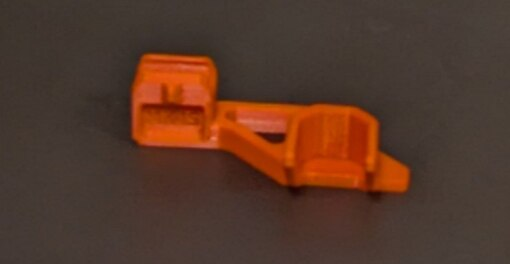
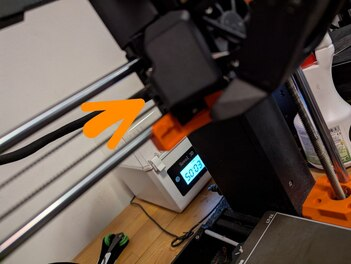
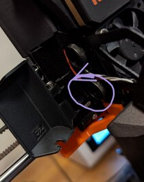
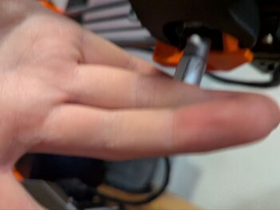
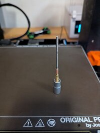
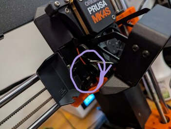
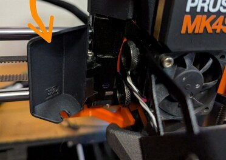

# Nozzle Change (MK4S mit Nozzle-Changer)

## Nozzle-Changer holen

## Unten montieren

## Tür öffnen

## Räder gegen den uhrzeigersinn aufdrehen

## Schraubendreher holen

## In Uhrzeigersinn Nozzle abdrehen

## Neue Nozzle nehmen

## Montieren

## Räder im Uhrzeigersinn schließen

## Tür schließen

## Nozzle-Changer entfernen

